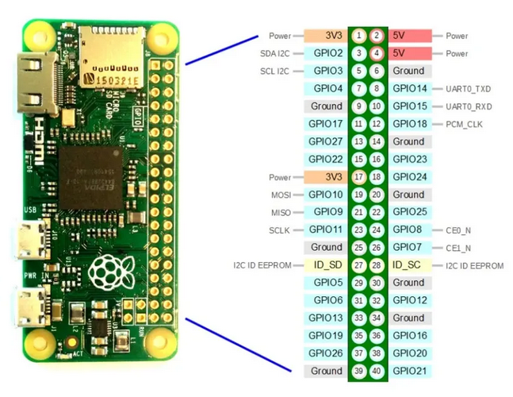

## Components

### Raspberry Pi zero 2 W

### KeyeStudio

See doc here https://docs.keyestudio.com/projects/KS0314/en/latest/

But it's bullshit. The thing that worked for me was

```bash
git clone https://github.com/HinTak/seeed-voicecard.git
cd seeed-voicecard
git checkout v6.12 # kernel version
sudo ./install.sh
sudo reboot
```

The mess around with \`alsamixer to set the volume right. Then run

```
aplay -D "plughw:<sound card id>,0" /usr/share/sounds/alsa/Front_Center.wav
```

To tests the mic too (my sound card is 1):

```
arecord -D "plughw:1,0" -f S16_LE -r 16000 -d 5 -t wav test.wav
aplay -D "plughw:1,0" test.wav
```

### LCD display

https://www.waveshare.com/wiki/2inch_LCD_Module

Running it the python way is fine. No need for fancy stuff. See the examples.

### Pinout

- I plugged the LCD display where it should be with no consideration to the keyestudio hat whatsoever. The hat's leds pins are overlapping on the SPI, so whenever using the LCD display the hat's led are always on (white).
  

- The 3 pushbuttons are on pins

  - GPIO16 (pin 36), GND (pin 39)
  - GPIO20 (pin 38), GND (pin 39)
  - GPIO21 (pin 40), GND (pin 39)


